<picture>
  <source media="(prefers-color-scheme: dark)" srcset="assets/banner-dark.svg">
  
</picture>

B2B 콘텐츠 제안 PM으로 3년간 누적 **17.18억 원** 매출을 책임졌습니다. 지금은 그 판단 기준을 코드로 옮겨 — 추천 수식 설계부터 RAG 검색·평가 파이프라인, 에이전트 안전 설계까지 직접 만들고 측정합니다. 기획의 언어와 엔지니어링의 언어를 한 테이블에 올립니다.

### 대표 프로젝트

<table>
<tr>
<td width="50%">
<a href="https://ljhljh0703-cmd.github.io/AI-Book-Curation/portfolio.html">
<picture><source media="(prefers-color-scheme: dark)" srcset="assets/card-bookmon-dark.svg"></picture>
</a>
</td>
<td width="50%">
<a href="https://ljhljh0703-cmd.github.io/Medical-Chatbot/portfolio.html">
<picture><source media="(prefers-color-scheme: dark)" srcset="assets/card-medical-rag-dark.svg"></picture>
</a>
</td>
</tr>
<tr>
<td width="50%">
<a href="https://ljhljh0703-cmd.github.io/ai-npc-social-reasoning-harness/">
<picture><source media="(prefers-color-scheme: dark)" srcset="assets/card-rocket-sim-dark.svg"></picture>
</a>
</td>
<td width="50%">
<a href="https://ljhljh0703-cmd.github.io/hyunsoo-bot/portfolio.html">
<picture><source media="(prefers-color-scheme: dark)" srcset="assets/card-hyunsoo-bot-dark.svg"></picture>
</a>
</td>
</tr>
<tr>
<td width="50%">
<a href="https://ljhljh0703-cmd.github.io/StarLink/portfolio.html">
<picture><source media="(prefers-color-scheme: dark)" srcset="assets/card-starlink-dark.svg"></picture>
</a>
</td>
<td width="50%" align="center" valign="middle">
<a href="https://github.com/ljhljh0703-cmd?tab=repositories"><b>+ 전체 저장소 보기 →</b></a> 
Game-PM AI Suite · AI Game Dev 등은 포트폴리오 완성 후 카드로 합류합니다.
</td>
</tr>
</table>

### 함께 보기

- 🗺 **[Learning Atlas](https://ljhljh0703-cmd.github.io/learning-atlas/)** — 학습 아카이브. 182편, 매주 자동 갱신, 누출 0. 이 포트폴리오를 만든 시스템입니다.
- 🎨 **[Vibe Design Studio](https://ljhljh0703-cmd.github.io/VDS/)** — 디자인 시스템 스튜디오. 카탈로그 77 · 프리셋 33, 카드마다 복붙 DESIGN.md.
- 🎮 **주형 유니버스** — 이력서를 걸어서 탐험하는 인터랙티브 월드. 준비 중.

### 수치를 읽는 법

이 프로필의 수치는 원문 실측만 씁니다. stage 라벨(데모 · 작동 프로토타입 · 탐색 연구)을 그대로 두고, 측정 전인 것은 측정 전이라고 표기합니다 — 로켓단의 결과는 claim gate를 넘지 못해 "탐색적 경향"으로만 보고합니다.

배너·카드의 애니메이션은 외부 서비스 없이 SVG+CSS로 직접 설계했습니다. 각 카드의 모션은 그 프로젝트의 실제 메커니즘입니다 — 북켓몬은 순위를 다시 매기고, 의료 챗봇은 응급 키워드를 게이트에서 차단하고, 현수봇의 판단 펄스는 리스크 게이트 앞에서 멈춥니다.
